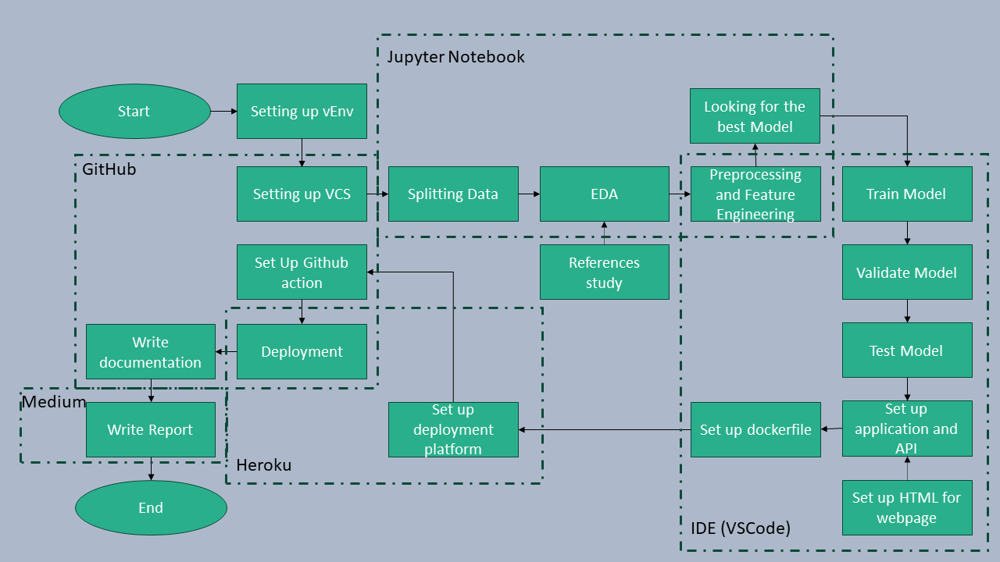

# Wine Quality Project

## 1. How to use

### A. User
1. Ensure the internet connection is stable
2. Go to https://winequalityprediction-11c4d5e93f8d.herokuapp.com/
3. Input all the required data. All data need to be a float type (number). Please pay attention to the accepted range value for each data. Use dot ( . ) as decimal separator
4. Click submit and the predicted values will come up.
5. The output value will be either "Good" or "Bad" indicate whether the quality of the wine is good or bad.

### B. Engineer
1. If no modification to be made. Run through steps from sub-section A.
2. Put the data on /Data/Splitted directory and replace the data accordingly.
- X_train.csv and y_train.csv for training data.
- X_val.csv and y_val.csv for validation data.
- X_test.csv and y_test.csv for testing data.
3. Run Src/train_model.py to train a model from new data (the model will be saved in Models/model.pkl).
4. Run Src/validation_model.py to validate new model.
5. Run app.py to deploy the model in local.

### C. EDA
Exploratory Data Analysis is done using notebook in Notebook/wine_quality_notebook.ipynb

## Project Description

### Data 

The data contains 10 chemical parameters and a wine quality score for 4,898 wines. For simplicity purpose, the wine quality score was categorized into "Good" and "Bad" categories.

Due to high scores in correlation, 'density' and 'total_feature_dioxide' features are dropped. We only used 'fixed_acidity', 'volatile_acidity', 'citric_acid', 'residual_sugar', 'chlorides', 'free_sulfur_dioxide', 'pH', 'sulphates', 'alcohol'.

### Problem to be solved and the goals

Understanding and predicting wine quality can enable businesses to tailor their products to meet consumer preferences. Different customers have different tastes, yet choosing the best wine options to get stocked in the store is essentials. Tasting every single wine we would like to buy before purchasing it is practically impossible. Thus machine learning can help to predict which wine is worth buying as an option for our store.

The goal for this project is to develop a machine learning model that accurately predicts wine quality based on various chemical and sensory attributes, allowing your store to make informed decisions about which wines to stock to meet consumer preferences effectively

### Project Flows

## Conclusion
The model can deliver the expedcted results of the project. In the future it will be more convenient if the deployed model can handle batch prediction.

## Reference
Data link: https://archive.ics.uci.edu/dataset/186/wine+quality

Deployed model: https://winequalityprediction-11c4d5e93f8d.herokuapp.com/

Medium: https://medium.com/@col.flamealchemist/wine-quality-prediction-0c891c00f11e
